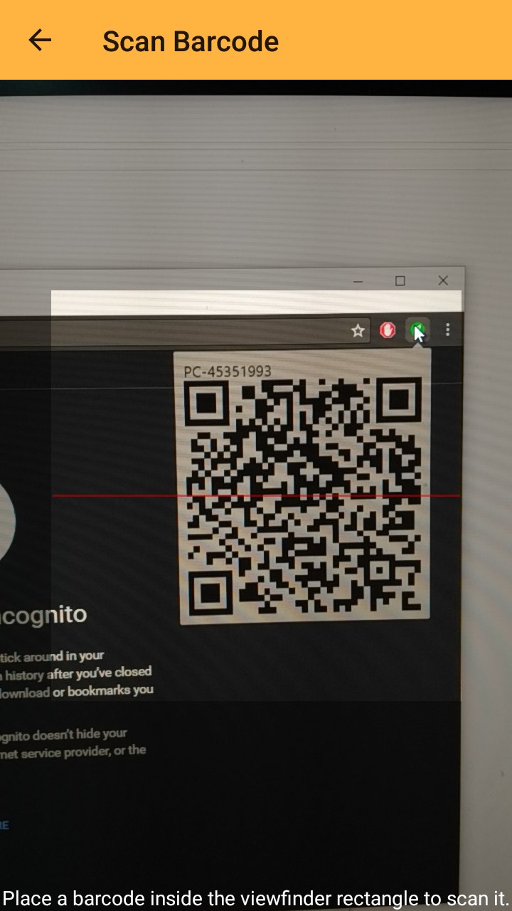

# Swift Login Web Extension

The swift login browser extension acts as a sessions receiver from the [swift login mobile application](https://github.com/RohithSrk/swift-login). Its basic functionalities are receiving the sessions sent by the mobile phones and re-setting each cookie from the session into the desktop browser. It also receives requests to destroy the sessions of the desktop browser. 

## Components

* QR Code Generator
* Web Socket Client
* Decryption Module
